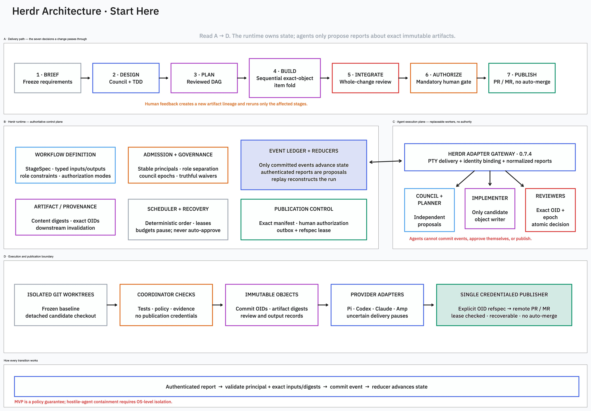

# Herdr Workflow

Herdr is a composable, event-sourced workflow framework for coordinating independent AI agents through adversarially reviewed software delivery.

The framework keeps authority in a deterministic runtime: agents propose authenticated reports about exact immutable artifacts, while committed events and reducers advance workflow state. Publication always requires explicit human authorization.

> **Status:** Draft v0.7 — M1 runtime implementation in progress.



## Start here

- [Workflow specification](docs/workflow-spec.md)
- [Editable tldraw architecture](docs/architecture.tldraw)
- [Architecture preview](docs/architecture.png)

The editable canvas has two pages:

1. **Architecture · Start Here** — a concise layered system view.
2. **Detailed Workflow** — the complete delivery and review graph.

## Core ideas

- Independent design proposals and sealed adversarial critique
- Reviewed TDD and deterministic plan-DAG expansion
- Sequential exact-object implementation and review
- Event-sourced state transitions with replayable reducers
- Stable principals, role separation, budgets, and recovery
- Artifact provenance with deterministic downstream invalidation
- Whole-change integration review
- Mandatory human publication gate
- A single recoverable publisher using explicit object refspecs

## Repository layout

```text
crates/
  herdr-flow-core/      Pure protocol and reducer logic
  herdr-flow-store/     Persistence adapters
  herdr-flow-cli/       Coordinator executable
docs/
  workflow-spec.md      Draft v0.7 specification
  architecture.tldraw  Editable architecture and detailed workflow
  architecture.png     Rendered architecture preview
  decisions/            Architecture decision records
examples/
  README.md             Planned workflow examples
```

## Editing the architecture

Open `docs/architecture.tldraw` in [tldraw](https://www.tldraw.com/) or tldraw offline. Use **Architecture · Start Here** for the overview and **Detailed Workflow** for the full graph.

## Development

The Rust version is pinned in `rust-toolchain.toml`. After installing [rustup](https://rustup.rs/), run:

```bash
just check
cargo run -p herdr-flow-cli -- --version
```

`just check` runs formatting checks, Clippy with warnings denied, and all workspace tests.

## Scope

Implementation begins with the M1 deterministic runtime kernel and static adversarial-review pipeline. Provider adapters, schemas, conformance fixtures, and reference workflows will be added incrementally after the core boundaries are proven.

## License

No license has been selected yet.
